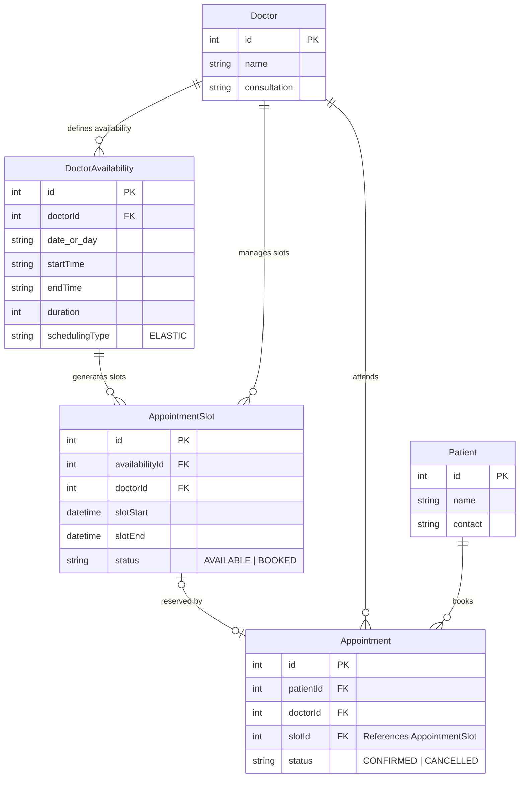
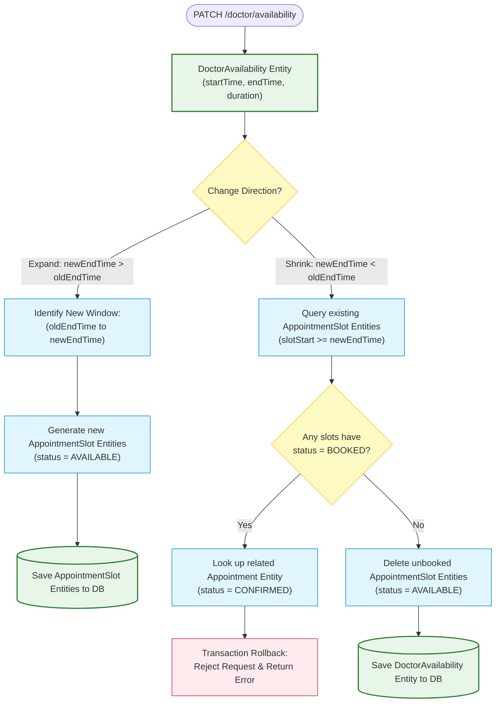

# Doctor Scheduling Flow Charts

## Stream Scheduling Flow
```
Doctor sets scheduling type
           │
           ▼
  schedulingType = STREAM
           │
           ▼
Doctor sets availability
  (dayOfWeek, startTime, endTime,
   slotDuration, bufferTime)
           │
           ▼
POST /doctor/availability/:id/generate?date=YYYY-MM-DD
           │
           ▼
System generates exact slots
  ┌─────────────────────────────┐
  │ 10:00 – 10:15  (slot 1)    │
  │ 10:20 – 10:35  (slot 2)    │
  │ 10:40 – 10:55  (slot 3)    │
  └─────────────────────────────┘
           │
           ▼
Patient fetches availability
GET /patient/availability/:doctorId?date=YYYY-MM-DD
           │
           ▼
Patient sees exact time slots
  ┌──────────────────────────────────┐
  │ Slot 1: 10:00–10:15  Available  │
  │ Slot 2: 10:20–10:35  Available  │
  │ Slot 3: 10:40–10:55  Booked     │
  └──────────────────────────────────┘
           │
           ▼
Patient books a slot
POST /patient/availability/book/stream
  { streamSlotId, doctorId }
           │
           ▼
  ┌─────────────────────────┐
  │ Slot already booked?    │
  │ YES → 409 Conflict      │
  │ NO  → Booking confirmed │
  └─────────────────────────┘
           │
           ▼
Patient gets exact appointment time
  {
    appointmentTime: "10:00 – 10:15"
  }
```

---

## Wave Scheduling Flow
```
Doctor sets scheduling type
           │
           ▼
  schedulingType = WAVE
           │
           ▼
Doctor sets availability
  (dayOfWeek, startTime, endTime,
   maxCapacity)
           │
           ▼
POST /doctor/availability/:id/generate?date=YYYY-MM-DD
           │
           ▼
System creates one wave window
  ┌─────────────────────────────┐
  │ 10:00 – 11:00               │
  │ maxPatients: 5              │
  │ bookedCount: 0              │
  │ available: 5/5              │
  └─────────────────────────────┘
           │
           ▼
Patient fetches availability
GET /patient/availability/:doctorId?date=YYYY-MM-DD
           │
           ▼
Patient sees wave window
  ┌──────────────────────────────┐
  │ Time Window: 10:00 – 11:00  │
  │ Available: 3/5              │
  └──────────────────────────────┘
           │
           ▼
Patient books into wave
POST /patient/availability/book/wave
  { waveId, doctorId }
           │
           ▼
  ┌──────────────────────────────┐
  │ Wave full?                   │
  │ YES → 409 Conflict           │
  │       "Wave is full"         │
  │ NO  → Assign token number    │
  │       tokenNumber = count+1  │
  └──────────────────────────────┘
           │
           ▼
Patient gets token number
  {
    timeWindow: "10:00 – 11:00",
    tokenNumber: 3
  }
```

---

## Summary

| Feature | STREAM | WAVE |
|---------|--------|------|
| Appointment type | Exact time slot | Time window |
| Patient gets | 10:00 – 10:15 | Token No: 3 |
| Config needed | slotDuration, bufferTime | maxCapacity |
| Use case | Specialists, detailed consult | OPD, high volume |
| Overbooking | Not possible (slot marked booked) | Not possible (capacity check) |
| Token | Not applicable | Sequential (1, 2, 3...) |

---

## Elastic Scheduling Entity & Flow Diagrams

### Entity Relationship Diagram (ERD)



### Elastic Scheduling (Expand & Shrink) Flow Diagram



### 2D Graphical Architecture Diagram


