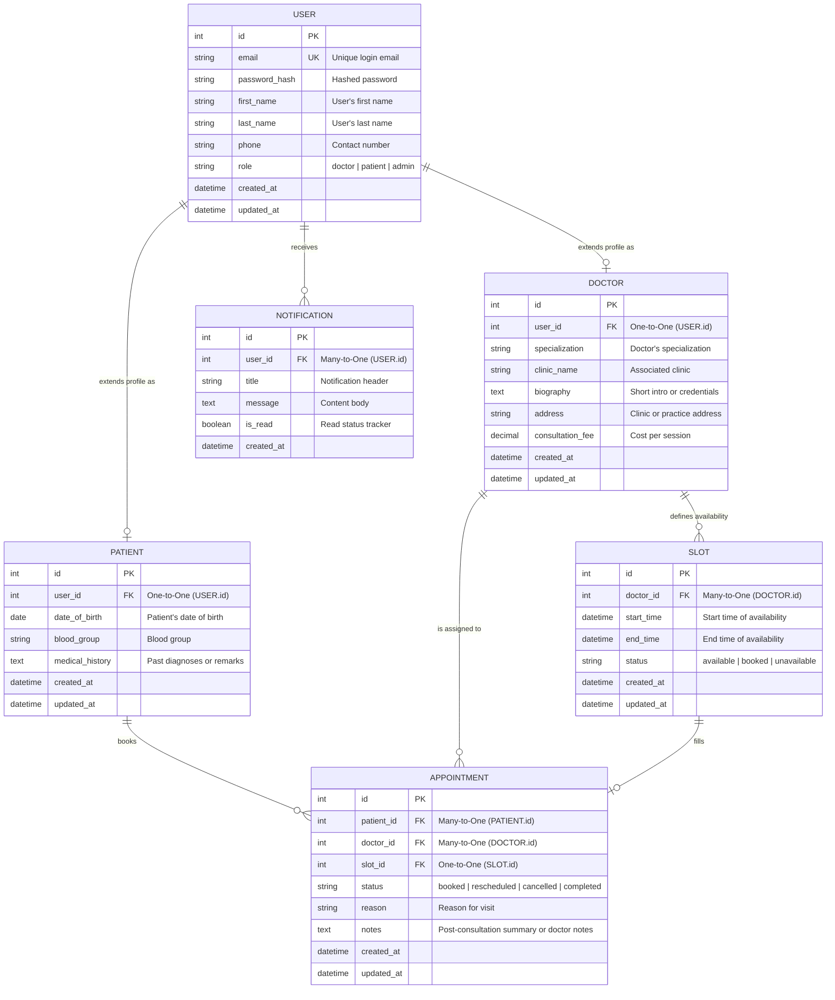

# Schedula Database Schema & Entity Relationship Diagram (ERD)

This document describes the database design for **Schedula**, a Doctor Appointment Scheduling Application.

---

## 1. Entity Relationship Diagram (ERD)

Below is the visual ER diagram generated using Mermaid notation:

---

## 2. Entities & Attribute Details

### 2.1. `USER`
Represents authentication and core identity credentials. Patients, Doctors, and Administrators all have an associated `USER` account.
*   `id` (Integer, Primary Key, Auto-increment)
*   `email` (String, Unique, Index): Registered email address for login.
*   `password_hash` (String): Securely hashed password.
*   `first_name` (String): User's first name.
*   `last_name` (String): User's last name.
*   `phone` (String, Optional): Contact number.
*   `role` (Enum): Distinguishes permissions: `'doctor'`, `'patient'`, or `'admin'`.
*   `created_at` / `updated_at` (Datetime): Audit timestamps.

### 2.2. `DOCTOR`
Holds profile information specific to doctors. Extends the `USER` entity.
*   `id` (Integer, Primary Key, Auto-increment)
*   `user_id` (Integer, Foreign Key pointing to `USER.id`, Unique constraint): Link to the User account.
*   `specialization` (String): e.g., "Cardiologist", "Dermatologist".
*   `clinic_name` (String): Clinic or Hospital name.
*   `biography` (Text): Details about experience, credentials, and achievements.
*   `address` (String): Location details.
*   `consultation_fee` (Decimal): Fee charged per appointment session.
*   `created_at` / `updated_at` (Datetime)

### 2.3. `PATIENT`
Holds profile details specific to patients. Extends the `USER` entity.
*   `id` (Integer, Primary Key, Auto-increment)
*   `user_id` (Integer, Foreign Key pointing to `USER.id`, Unique constraint): Link to the User account.
*   `date_of_birth` (Date): Birthdate for calculating age/pediatrics context.
*   `blood_group` (String): e.g., "O+", "A-".
*   `medical_history` (Text, Optional): Existing chronic conditions, past surgeries, or allergies.
*   `created_at` / `updated_at` (Datetime)

### 2.4. `SLOT`
Defines time durations during which a doctor is available.
*   `id` (Integer, Primary Key, Auto-increment)
*   `doctor_id` (Integer, Foreign Key pointing to `DOCTOR.id`): Doctor to whom this slot belongs.
*   `start_time` (Datetime): Exact start date & time.
*   `end_time` (Datetime): Exact end date & time.
*   `status` (Enum): Current state of availability (`'available'`, `'booked'`, `'unavailable'`).
*   `created_at` / `updated_at` (Datetime)

### 2.5. `APPOINTMENT`
Links a Patient, a Doctor, and a Slot together when a booking is confirmed.
*   `id` (Integer, Primary Key, Auto-increment)
*   `patient_id` (Integer, Foreign Key pointing to `PATIENT.id`): Patient who booked the appointment.
*   `doctor_id` (Integer, Foreign Key pointing to `DOCTOR.id`): Doctor attending the patient.
*   `slot_id` (Integer, Foreign Key pointing to `SLOT.id`, Unique constraint): The slot reserved.
*   `status` (Enum): Appointment life-cycle status (`'booked'`, `'rescheduled'`, `'cancelled'`, `'completed'`).
*   `reason` (String): Primary concern description.
*   `notes` (Text, Optional): Medical notes written by the doctor during or after the session.
*   `created_at` / `updated_at` (Datetime)

### 2.6. `NOTIFICATION`
Manages real-time/historical updates (e.g., appointment confirmations, schedule changes) for any User.
*   `id` (Integer, Primary Key, Auto-increment)
*   `user_id` (Integer, Foreign Key pointing to `USER.id`): Recipient user.
*   `title` (String): Short title of the alert.
*   `message` (Text): Full description text.
*   `is_read` (Boolean): Read/Unread state flag. Default `false`.
*   `created_at` (Datetime)

---

## 3. Relationships Breakdown

1.  **User to Doctor/Patient (One-to-One):**
    *   A `USER` can optionally be associated with exactly one `DOCTOR` profile (if `role` is `'doctor'`) or one `PATIENT` profile (if `role` is `'patient'`).
2.  **Doctor to Slot (One-to-Many):**
    *   A `DOCTOR` defines multiple availability `SLOT` entries. A `SLOT` belongs to exactly one `DOCTOR`.
3.  **Patient to Appointment (One-to-Many):**
    *   A `PATIENT` can book multiple `APPOINTMENT`s over time.
4.  **Doctor to Appointment (One-to-Many):**
    *   A `DOCTOR` can be assigned to multiple `APPOINTMENT`s.
5.  **Slot to Appointment (One-to-One):**
    *   An `APPOINTMENT` is mapped to exactly one `SLOT`. A `SLOT` can have at most one active `APPOINTMENT` mapped to it (preventing double booking).
6.  **User to Notification (One-to-Many):**
    *   A `USER` (whether Doctor, Patient, or Admin) can receive multiple `NOTIFICATION` messages.
