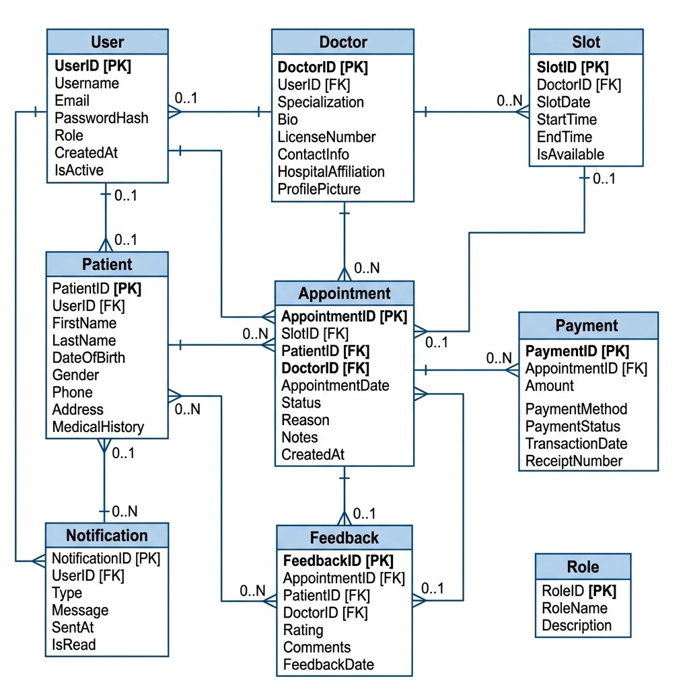
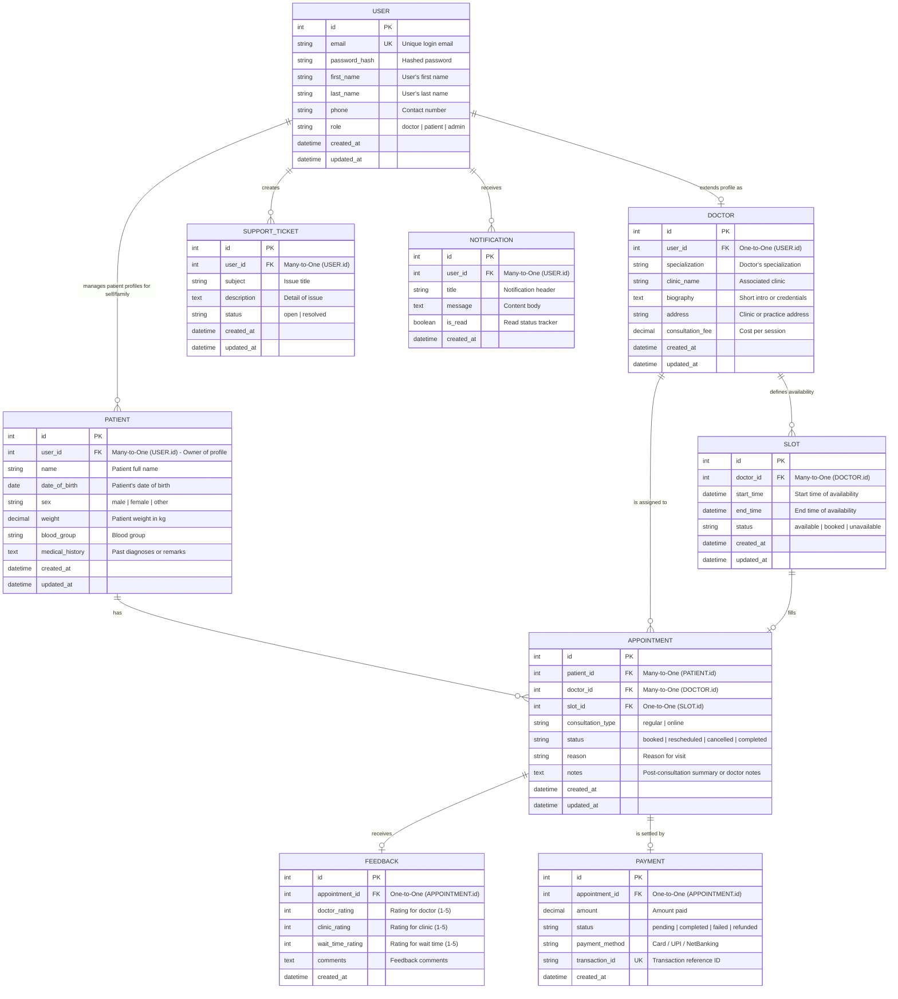

# Schedula Database Schema & Entity Relationship Diagram (ERD)

This document describes the database design for **Schedula**, a Doctor Appointment Scheduling Application.

---

## 1. Entity Relationship Diagram (ERD)

Below is the visual ER diagram (also available as an image in the repository at `docs/ER_DIAGRAM/ER-Diagram.png`):

### Mermaid Representation

---

## 2. Entities & Attribute Details

### 2.1. `USER`
Represents core identity and authentication credentials for all roles (Patient account owners, Doctors, Administrators).
*   `id` (Integer, Primary Key, Auto-increment)
*   `email` (String, Unique): Registered login email.
*   `password_hash` (String): Securely hashed password.
*   `first_name` (String): User's first name.
*   `last_name` (String): User's last name.
*   `phone` (String, Optional): Contact number.
*   `role` (Enum): `'doctor'`, `'patient'`, or `'admin'`.
*   `created_at` / `updated_at` (Datetime): Audit timestamps.

### 2.2. `DOCTOR`
Holds profile information specific to doctors. Extends the `USER` entity.
*   `id` (Integer, Primary Key, Auto-increment)
*   `user_id` (Integer, Foreign Key pointing to `USER.id`, Unique): Link to the base User account.
*   `specialization` (String): e.g., "Cardiologist", "Dermatologist".
*   `clinic_name` (String): Clinic or Hospital name.
*   `biography` (Text): Doctor's experience, credentials, and achievements.
*   `address` (String): Clinic location address.
*   `consultation_fee` (Decimal): Cost per appointment session.
*   `created_at` / `updated_at` (Datetime)

### 2.3. `PATIENT`
Represents the individual care seekers. A single `USER` account owner of role `'patient'` can manage multiple `PATIENT` profiles (e.g. self, child, parents) in their "Friends & Family" list.
*   `id` (Integer, Primary Key, Auto-increment)
*   `user_id` (Integer, Foreign Key pointing to `USER.id`): The account owner who created and manages this profile.
*   `name` (String): Full name of the patient.
*   `date_of_birth` (Date): Birthdate.
*   `sex` (String): e.g., "male", "female", "other".
*   `weight` (Decimal): Patient weight in kg.
*   `blood_group` (String): e.g., "O+", "A-".
*   `medical_history` (Text, Optional): Existing chronic conditions, past surgeries, or allergies.
*   `created_at` / `updated_at` (Datetime)

### 2.4. `SLOT`
Defines time durations during which a doctor is available.
*   `id` (Integer, Primary Key, Auto-increment)
*   `doctor_id` (Integer, Foreign Key pointing to `DOCTOR.id`): Associated doctor.
*   `start_time` (Datetime): Start date & time.
*   `end_time` (Datetime): End date & time.
*   `status` (Enum): `'available'`, `'booked'`, or `'unavailable'`.
*   `created_at` / `updated_at` (Datetime)

### 2.5. `APPOINTMENT`
Links a Patient profile, a Doctor, and an availability Slot when a booking is confirmed.
*   `id` (Integer, Primary Key, Auto-increment)
*   `patient_id` (Integer, Foreign Key pointing to `PATIENT.id`): The patient receiving consultation.
*   `doctor_id` (Integer, Foreign Key pointing to `DOCTOR.id`): The attending doctor.
*   `slot_id` (Integer, Foreign Key pointing to `SLOT.id`, Unique): The reserved slot.
*   `consultation_type` (Enum): `'regular'` (in-person) or `'online'`.
*   `status` (Enum): `'booked'`, `'rescheduled'`, `'cancelled'`, or `'completed'`.
*   `reason` (String): Reason for consultation / complaints.
*   `notes` (Text, Optional): Doctor notes or clinical summaries written post-consultation.
*   `created_at` / `updated_at` (Datetime)

### 2.6. `FEEDBACK`
Maintains post-appointment patient reviews.
*   `id` (Integer, Primary Key, Auto-increment)
*   `appointment_id` (Integer, Foreign Key pointing to `APPOINTMENT.id`, Unique): The related appointment.
*   `doctor_rating` (Integer): Rating for the doctor (1-5).
*   `clinic_rating` (Integer): Rating for the clinic facilities (1-5).
*   `wait_time_rating` (Integer): Rating for the wait time (1-5).
*   `comments` (Text, Optional): Written feedback.
*   `created_at` (Datetime)

### 2.7. `PAYMENT`
Details upfront payments processed for consultations.
*   `id` (Integer, Primary Key, Auto-increment)
*   `appointment_id` (Integer, Foreign Key pointing to `APPOINTMENT.id`, Unique): The related appointment.
*   `amount` (Decimal): Total consultation fee paid.
*   `status` (Enum): `'pending'`, `'completed'`, `'failed'`, or `'refunded'`.
*   `payment_method` (String): e.g., "Card", "UPI", "NetBanking".
*   `transaction_id` (String, Unique): Gateways transaction ID.
*   `created_at` (Datetime)

### 2.8. `SUPPORT_TICKET`
Stores customer support queries generated by users.
*   `id` (Integer, Primary Key, Auto-increment)
*   `user_id` (Integer, Foreign Key pointing to `USER.id`): The user raising the support request.
*   `subject` (String): Issue subject summary.
*   `description` (Text): Details of the query or problem.
*   `status` (Enum): `'open'` or `'resolved'`.
*   `created_at` / `updated_at` (Datetime)

### 2.9. `NOTIFICATION`
Manages reminders, rescheduling alerts, and cancellations for any user.
*   `id` (Integer, Primary Key, Auto-increment)
*   `user_id` (Integer, Foreign Key pointing to `USER.id`): Recipient user.
*   `title` (String): Alert header.
*   `message` (Text): Notification body.
*   `is_read` (Boolean): Read tracker flag. Default `false`.
*   `created_at` (Datetime)

---

## 3. Relationships Breakdown

1.  **User to Doctor (One-to-One):**
    *   A `USER` of role `'doctor'` can be associated with exactly one `DOCTOR` profile.
2.  **User to Patient Profiles (One-to-Many):**
    *   A `USER` of role `'patient'` can create and manage multiple `PATIENT` profiles (Friends & Family list).
3.  **Doctor to Slot (One-to-Many):**
    *   A `DOCTOR` defines multiple availability `SLOT` entries.
4.  **Patient to Appointment (One-to-Many):**
    *   A `PATIENT` profile can have multiple consultations over time.
5.  **Slot to Appointment (One-to-One):**
    *   An `APPOINTMENT` has a unique `SLOT` mapped to it (preventing double booking).
6.  **Appointment to Feedback (One-to-One):**
    *   An `APPOINTMENT` can have at most one associated `FEEDBACK` record.
7.  **Appointment to Payment (One-to-One):**
    *   An `APPOINTMENT` can have at most one `PAYMENT` record.
8.  **User to Support Tickets (One-to-Many):**
    *   A `USER` can raise multiple `SUPPORT_TICKET` requests.
9.  **User to Notification (One-to-Many):**
    *   A `USER` receives multiple `NOTIFICATION` messages.
