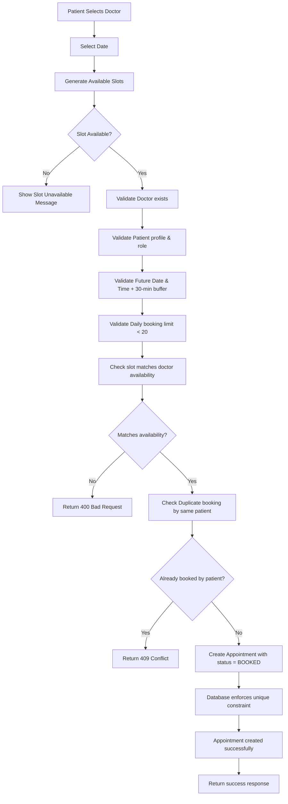

# Appointment Booking Flow Chart

This flowchart details the step-by-step validations and logic applied during patient appointment booking in the Schedula system.

```mermaid
flowchart TD
    A[Patient Selects Doctor] --> B[Select Date]
    B --> C[Generate Available Slots]
    C --> D{Slot Available?}

    D -- No --> E[Show Slot Unavailable Message]

    D -- Yes --> F[Validate Doctor exists]
    F --> G[Validate Patient profile & role]
    G --> H[Validate Future Date & Time + 30-min buffer]
    H --> I[Validate Daily booking limit < 20]
    I --> J[Check slot matches doctor availability]
    J --> K{Matches availability?}

    K -- No --> L[Return 400 Bad Request]
    K -- Yes --> M[Check Duplicate booking by same patient]
    M --> N{Already booked by patient?}

    N -- Yes --> O[Return 409 Conflict]
    N -- No --> P[Create Appointment with status = BOOKED]
    P --> Q[Database enforces unique constraint]
    Q --> R[Appointment created successfully]
    R --> S[Return success response]
```
