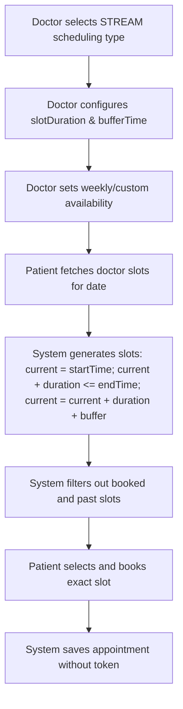
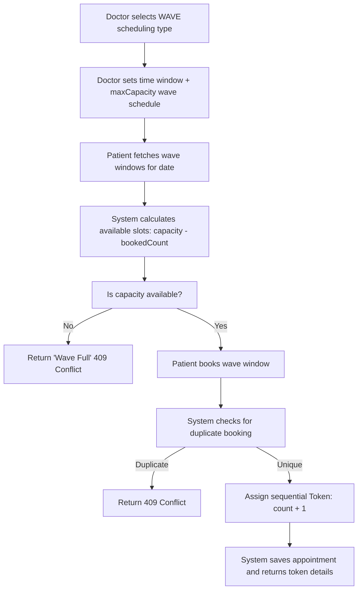

# Scheduling Flows

## Stream Scheduling Flow

```mermaid
graph TD
    A[Doctor selects STREAM scheduling type] --> B[Doctor configures slotDuration & bufferTime]
    B --> C[Doctor sets weekly/custom availability]
    C --> D[Patient fetches doctor slots for date]
    D --> E[System generates slots: current = startTime; current + duration <= endTime; current = current + duration + buffer]
    E --> F[System filters out booked and past slots]
    F --> G[Patient selects and books exact slot]
    G --> H[System saves appointment without token]
```

## Wave Scheduling Flow

```mermaid
graph TD
    A[Doctor selects WAVE scheduling type] --> B[Doctor sets time window + maxCapacity wave schedule]
    B --> C[Patient fetches wave windows for date]
    C --> D[System calculates available slots: capacity - bookedCount]
    D --> E[Is capacity available?]
    E -- No --> F[Return 'Wave Full' 409 Conflict]
    E -- Yes --> G[Patient books wave window]
    G --> H[System checks for duplicate booking]
    H -- Duplicate --> I[Return 409 Conflict]
    H -- Unique --> J[Assign sequential Token: count + 1]
    J --> K[System saves appointment and returns token details]
```
